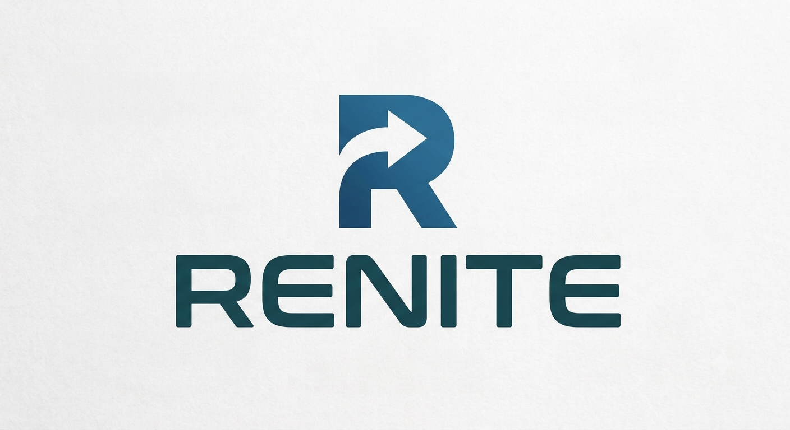

  

  <h1>
    <strong>RENITE</strong>
         
    🇪🇹 Nationwide Lost & Found, Missing Persons & Civic Safety Platform
  </h1>
  <h2>Your Community Radar</h2>

  <em>
    A secure, verification-driven platform connecting citizens, communities,
    and authorized organizations to report, discover, verify, and recover
    lost assets and missing persons.
  </em>

  
  
  
  

---

## 📌 Project Overview

**Renite** is a nationwide digital platform designed to help people **report, discover, verify, and recover lost assets and missing persons** through a secure and connected recovery network.

Unlike traditional lost-and-found systems that are limited to a campus, school, or organization, Renite is designed to operate at a **national level**, connecting citizens, communities, and authorized organizations.

The platform combines identity verification, AI-assisted matching, location intelligence, secure communication, recovery coordination, and community participation into one system.

---

## 🧩 The Problem Our Project Solves

People lose valuable belongings such as smartphones, laptops, tablets, documents, and other personal assets every day. At the same time, families and communities may struggle to coordinate information when someone goes missing.

Current recovery methods are often scattered across:

* Social media
* Messaging groups
* Local communities
* Institutions
* Informal lost-and-found systems

These approaches can make information difficult to verify, expose sensitive personal data, and reduce the chances of successful recovery.

**Renite addresses this problem by providing a centralized, secure, and verification-driven platform for nationwide recovery and civic safety.**

---

## ⚙️ Main Features We Plan to Develop

* **🛡️ Identity & Security**
  Secure Renite accounts with **Fayda as a mandatory secondary identity-verification mechanism**, while Renite maintains its own detailed user database and profile.

* **📱 Lost & Found Assets**
  Users can register valuable assets such as phones, laptops, tablets, and other belongings, then report them as lost or found.

* **👤 Missing-Person Reporting**
  Users can create missing-person reports with relevant information, photographs, locations, and case status while maintaining controlled access to sensitive data.

* **🤖 AI-Assisted Matching**
  AI and computer vision can assist in identifying potential matches between lost and found assets and help organize recovery information.

* **🗺️ National Location Intelligence**
  Map-based discovery for authorized lost-and-found activity, missing-person cases, nearby reports, and relevant safety information.

* **💬 Secure Communication**
  Controlled communication between owners, finders, communities, and authorized participants without unnecessarily exposing private contact information.

* **🚚 Recovery & Nationwide Shipping**
  Support verified handoffs, recovery coordination, delivery, and nationwide shipping for recovered assets.

* **💰 Payments & Rewards**
  Support recovery bounties, shipping payments, loyalty rewards, and community participation.

* **🌐 Multilingual Support**
  Designed to support English, Amharic, Oromo, Tigrinya, Somali, Arabic, and Swahili, including both LTR and RTL interfaces.

* **🔐 OWASP-Oriented Security**
  Security-by-design practices including authentication, authorization, input validation, rate limiting, secure file handling, privacy protection, and audit logging.

---

## 🛠️ Technology Stack

| Platform     | Technology                             |
| ------------ | -------------------------------------- |
| 🌐 Web       | React + JavaScript                     |
| 📱 Mobile    | React + JavaScript                       |
| ⚙️ Backend   | REST API + Business Logic              |
| 🗄️ Database | Secure Persistent Data Layer           |
| 🤖 AI        | Computer Vision / Intelligent Matching |
| 🪪 Identity  | Fayda + Renite Account System          |

---

## 👥 Team Members

| 👤 Full Name     | 🆔 CTC Number | 🏫 Classroom | Role |
| ---------------- | ------------- | ----------- | ---------------: |
| Chera Tolosa     | CTC-716-26    |            2 | `Supabase, API & Backend` |
| Dagimawi Solomon | CTC-6567-26   |            2 | `Police/low enforcement panel` |
| Dibora Sisay     | CTC-1457-26   |            2 | `Admin Dashboard ` |
| Eden Alemayehu   | CTC-1941-26   |            2 | `UI/Ux & Data Infrastructure` |
| Edom Anteneh     | CTC-1717-26   |            2 | `Project Leader & Client App` |

---

## 🤝 Contribution

Renite is developed collaboratively using GitHub.

Expected to follow the project's:

* Branching strategy
* Repository rulesets
* Issue tracking process
* Pull request requirements
* Code review standards
* CI requirements
* Security guidelines

---

## 📄 License

Distributed under the **MIT License**. See `LICENSE` for more.

---

  <strong>RENITE</strong>
   
  <em>Reclaim What's Yours. Help Bring Them Home.</em>
    
  
  

